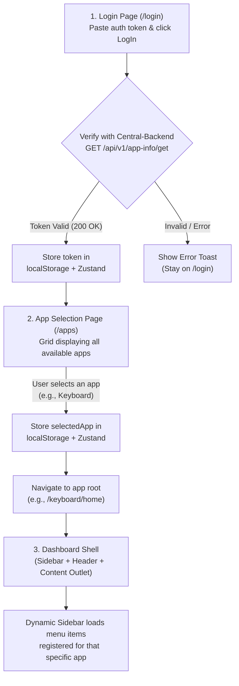

# Central-UI — Stage 0: Project Initialization Plan (v2)

> [!IMPORTANT]
> **Goal:** Bootstrap Central-UI with an **app-scoped folder architecture** — separate API configs, pages, services, queries, and store slices per app (e.g., `keyboard/`) while keeping common/central pieces at the top level.

---

## 1. High-Level Flow



#### Visual Flow Summary:
```text
[ 1. Login Page (/login) ]
       │ (User pastes token & clicks "LogIn")
       ▼
[ Verify via Central-Backend: GET /api/v1/app-info/get ]
       ├─── (Failed / 401) ──► [ Show Error Toast (Stay on /login) ]
       │
       └─── (200 OK: Valid Token)
              ▼
[ Store token in localStorage + Zustand ]
              ▼
[ 2. App Selection Page (/apps) ]
       │ (Displays grid of available apps)
       │ (User clicks an app card, e.g. "Keyboard")
       ▼
[ Store selectedApp in Zustand memory ]
              ▼
[ Navigate to app root (e.g. /keyboard/home) ]
              ▼
[ 3. Dashboard Shell ]
  ├── Top Site Header
  ├── Dynamic App Sidebar (loaded from sidebarRegistry)
  └── Main Content Outlet (Home Page)
```

---

## 2. Project Scaffolding (Unchanged)

| Step | Command | Purpose |
|------|---------|---------|
| 1 | `npx shadcn@latest init --preset b7Br7G7Ci --template vite --pointer` | Scaffold Vite+React+TS project with shadcn preset |
| 2 | `npm i zustand @tanstack/react-query axios zod sonner react-router react-router-dom @tabler/icons-react` | Core packages |
| 3 | `npm i -D @types/react-router-dom @types/node` | Dev types |

---

## 3. Directory Structure (Updated ★)

```
Central-UI/
├── src/
│   ├── api/
│   │   ├── config/
│   │   │   ├── centralApiConfig.ts     # ★ Endpoints for Central-Backend
│   │   │   └── keyboardApiConfig.ts    # ★ Endpoints for Keyboard app's backend
│   │   ├── centralInstance.ts          # ★ Axios instance → Central-Backend (VITE_SERVER_URL)
│   │   ├── appInstance.ts              # ★ Axios instance → selected app's backendBaseUrl (dynamic)
│   │   └── apiClient.ts                # ★ createApiClient(config, instance) — parameterized
│   │
│   ├── app/
│   │   └── appData.ts                 # Static app metadata (appName: "Central")
│   │
│   ├── components/
│   │   ├── ui/                        # shadcn components (auto-managed)
│   │   ├── inputComponents/           # Copied from Adsshare-app-web
│   │   │   ├── date-picker-component.tsx
│   │   │   ├── image-select-component.tsx
│   │   │   ├── multi-select-component.tsx
│   │   │   ├── multi-string-component.tsx
│   │   │   ├── select-component.tsx
│   │   │   └── time-picker-component.tsx
│   │   ├── mediaComponents/           # Copied from Adsshare-app-web
│   │   │   ├── media-upload.tsx
│   │   │   ├── multi-drop-box.tsx
│   │   │   └── single-drop-box.tsx
│   │   ├── app-sidebar.tsx            # Dynamic sidebar (reads config per selected app)
│   │   ├── layout.tsx                 # SidebarProvider + Header + Outlet
│   │   ├── site-header.tsx            # Top header
│   │   ├── nav-main.tsx               # Sidebar nav renderer
│   │   ├── nav-secondary.tsx          # Bottom sidebar section
│   │   ├── nav-user.tsx               # User menu in sidebar footer
│   │   ├── mode-toggle.tsx            # Dark/Light theme toggle
│   │   ├── theme-provider.tsx         # Theme context provider
│   │   └── loader.tsx                 # Loading spinner
│   │
│   ├── configurations/
│   │   ├── types.ts                   # Sidebar config types
│   │   ├── sidebarRegistry.ts         # Maps appName → sidebar config
│   │   └── apps/
│   │       └── keyboard.ts            # Sidebar config for Keyboard app
│   │
│   ├── pages/
│   │   ├── auth/                      # ← Common pages
│   │   │   ├── login.tsx
│   │   │   └── login-config.tsx
│   │   ├── appSelection/              # ← Common pages
│   │   │   ├── app-selection.tsx
│   │   │   └── app-selection-config.tsx
│   │   └── apps/                      # ★ App-specific pages
│   │       └── keyboard/
│   │           ├── keyboard-routes.tsx # ★ App-specific router config
│   │           └── home/
│   │               ├── home.tsx
│   │               └── home-config.tsx
│   │
│   ├── routes/
│   │   ├── router.tsx
│   │   ├── protected-route.tsx
│   │   ├── app-guard.tsx
│   │   └── types.ts
│   │
│   ├── services/
│   │   ├── appInfo.ts                 # ← Common (Central-Backend)
│   │   └── keyboard/                  # ★ Keyboard-specific services
│   │       └── (future service files)
│   │
│   ├── query/
│   │   ├── useAppInfo.ts              # ← Common (Central-Backend)
│   │   └── keyboard/                  # ★ Keyboard-specific queries
│   │       └── (future query files)
│   │
│   ├── store/
│   │   ├── index.ts                   # Combined store (common + app slices)
│   │   ├── slices/                    # ← Common slices
│   │   │   ├── AuthSlice.ts
│   │   │   └── AppSlice.ts
│   │   └── keyboard/                  # ★ Keyboard-specific slices
│   │       └── (future slice files)
│   │
│   ├── utils/
│   │   ├── queryClient.ts
│   │   ├── getErrorMessage.ts
│   │   └── schemas/                   # Zod schemas
│   │
│   ├── App.tsx
│   ├── App.css
│   ├── main.tsx
│   ├── index.css
│   └── vite-env.d.ts
│
├── .env
├── .env.example
├── components.json
├── package.json
├── tsconfig.json
├── vite.config.ts
└── README.md
```

---

## 4. Architecture Details (Updated)

### 4.1 Dual Axios Instances ★

This is the key architectural change — **two instances** because central APIs and app-specific APIs hit **different backends**.

#### `centralInstance.ts` — for Central-Backend

```ts
// Hits VITE_SERVER_URL (Central-Backend, e.g., http://localhost:3000)
const centralInstance = axios.create({
  baseURL: import.meta.env.VITE_SERVER_URL,
  headers: { "Content-Type": "application/json" },
});

// Request interceptor: inject Bearer token from Zustand/localStorage
centralInstance.interceptors.request.use((config) => {
  const token = useAppStore.getState().token;
  if (token) config.headers["Authorization"] = `Bearer ${token}`;
  return config;
});

// Response interceptor: 401/403 → clear session → redirect /login
centralInstance.interceptors.response.use(
  (res) => res,
  (error) => {
    if (error.response?.status === 401 || error.response?.status === 403) {
      useAppStore.getState().clearAuth();
      useAppStore.getState().clearApp();
    }
    // ... toast on 500, network error
  }
);
```

#### `appInstance.ts` — for Selected App's Backend

```ts
// Hits the selected app's backendBaseUrl (dynamic, read from Zustand)
const appInstance = axios.create({
  headers: { "Content-Type": "application/json" },
});

// Request interceptor: set baseURL dynamically + inject token
appInstance.interceptors.request.use((config) => {
  const { token, selectedApp } = useAppStore.getState();
  if (selectedApp?.backendBaseUrl) {
    config.baseURL = selectedApp.backendBaseUrl;
  }
  if (token) config.headers["Authorization"] = `Bearer ${token}`;
  return config;
});

// Response interceptor: same 401/403 handling
```

> [!IMPORTANT]
> `appInstance` reads `backendBaseUrl` **on every request** from Zustand, so it automatically points to whichever app is currently selected.

### 4.2 API Config Files ★

#### `api/config/centralApiConfig.ts`

```ts
import type { ApiEndpoint } from "./types";  // shared type

export const centralApiConfig: ApiEndpoint[] = [
  { name: "getApps",    path: "/api/v1/app-info/get" },
  { name: "getAppById", path: "/api/v1/app-info/get/{id}", hasPathParams: true },
  { name: "addApp",     path: "/api/v1/app-info/add" },
  { name: "updateApp",  path: "/api/v1/app-info/update/{id}", hasPathParams: true },
  { name: "deleteApp",  path: "/api/v1/app-info/delete/{id}", hasPathParams: true },
];
```

#### `api/config/keyboardApiConfig.ts`

```ts
import type { ApiEndpoint } from "./types";

export const keyboardApiConfig: ApiEndpoint[] = [
  // Keyboard app's own endpoints (will be populated as we build features)
  // e.g.: { name: "getThemes", path: "/api/v1/theme" },
];
```

#### `api/config/types.ts` (shared)

```ts
export interface ApiEndpoint {
  name: string;
  path: string;
  hasPathParams?: boolean;
}
```

### 4.3 Parameterized `apiClient.ts` ★

The `createApiClient()` hook now takes **config** and **instance** as parameters:

```ts
import type { ApiEndpoint } from "./config/types";
import type { AxiosInstance } from "axios";

export const createApiClient = (config: ApiEndpoint[], instance: AxiosInstance) => {
  const getEndpoint = (name: string): ApiEndpoint => {
    const endpoint = config.find((e) => e.name === name);
    if (!endpoint) throw new Error(`Endpoint "${name}" not found!`);
    return endpoint;
  };

  const constructUrl = (endpoint: ApiEndpoint, pathParams?: Record<string, string>) => {
    let url = endpoint.path;
    if (endpoint.hasPathParams && pathParams) {
      Object.keys(pathParams).forEach((param) => {
        url = url.replace(`{${param}}`, pathParams[param]);
      });
    }
    return url;
  };

  const get = async (name: string, params?: Record<string, unknown>, headers?: Record<string, unknown>, pathParams?: Record<string, string>) => {
    const endpoint = getEndpoint(name);
    const url = constructUrl(endpoint, pathParams);
    const response = await instance.get(url, { params, headers });
    return response;
  };

  // ... post, patch, put, del (same pattern)

  return { get, post, patch, put, del };
};
```

**Usage in services:**

```ts
// services/appInfo.ts (Central-Backend)
import { createApiClient } from "@/api/apiHooks";
import { centralApiConfig } from "@/api/config/centralApiConfig";
import centralInstance from "@/api/centralInstance";

export const getApps = async () => {
  const { data } = await createApiClient(centralApiConfig, centralInstance).get("getApps");
  return data;
};
```

```ts
// services/keyboard/someService.ts (Keyboard app's backend)
import { createApiClient } from "@/api/apiHooks";
import { keyboardApiConfig } from "@/api/config/keyboardApiConfig";
import appInstance from "@/api/appInstance";

export const getThemes = async () => {
  const { data } = await createApiClient(keyboardApiConfig, appInstance).get("getThemes");
  return data;
};
```

### 4.4 Zustand Store (Updated Structure) ★

```
store/
├── index.ts           # Combined: common + keyboard slices
├── slices/            # Common slices
│   ├── AuthSlice.ts   # token, loadToken(), setToken(), clearAuth()
│   └── AppSlice.ts    # selectedApp, loadApp(), setSelectedApp(), clearApp()
└── keyboard/          # Keyboard-specific slices
    └── (empty for now — future slices added here)
```

**Combined store** (`store/index.ts`):

```ts
import { create } from "zustand";
import { createAuthSlice, type AuthState } from "./slices/AuthSlice";
import { createAppSlice, type AppState } from "./slices/AppSlice";
// Future: import { createKeyboardSlice, type KeyboardState } from "./keyboard/KeyboardSlice";

interface CentralState extends AuthState, AppState {
  // Future: & KeyboardState
}

export const useAppStore = create<CentralState>()((...args) => ({
  ...createAuthSlice(...args),
  ...createAppSlice(...args),
  // Future: ...createKeyboardSlice(...args),
}));
```

> [!NOTE]
> All keyboard slices merge into the **single global `useAppStore`**. When a new app slice is added in `store/keyboard/`, it's imported and spread into the combined store here.

### 4.5 Service-Query Pattern (Updated Folder Structure) ★

| Scope | Service Location | Query Location | Axios Instance |
|-------|-----------------|----------------|----------------|
| **Common** (Central-Backend) | `services/appInfo.ts` | `query/useAppInfo.ts` | `centralInstance` |
| **Keyboard** | `services/keyboard/*.ts` | `query/keyboard/*.ts` | `appInstance` |
| **Future App X** | `services/appX/*.ts` | `query/appX/*.ts` | `appInstance` |

---

## 5. Page-by-Page Design

### 5.1 Login Page (`/login`) — Common

| Element | Details |
|---------|---------|
| **Location** | `pages/auth/login.tsx` + `login-config.tsx` |
| **Layout** | Full-screen centered card (no sidebar/header) |
| **Content** | Title: "Central Dashboard" · `<Input>` for token · `<Button>` "LogIn" |
| **On Click** | Call `getApps()` with token → OK → `setToken(token)` → navigate `/apps` |

### 5.2 App Selection Page (`/apps`) — Common

| Element | Details |
|---------|---------|
| **Location** | `pages/appSelection/app-selection.tsx` + `app-selection-config.tsx` |
| **Guard** | `ProtectedRoute` (needs token) |
| **Content** | Grid of app cards from `useGetApps()` |
| **On Click Card** | `setSelectedApp(app)` → navigate `/{appName}/home` |

### 5.3 Keyboard Home (`/keyboard/home`) — App-Specific ★

| Element | Details |
|---------|---------|
| **Location** | `pages/apps/keyboard/home/home.tsx` + `home-config.tsx` |
| **Guard** | `ProtectedRoute` + `AppGuard` |
| **Layout** | Dashboard shell (sidebar + header + outlet) |
| **Content** | Placeholder: "Welcome to Keyboard Dashboard" |

---

## 6. Dynamic Sidebar Architecture (Unchanged)

```
configurations/
├── types.ts              # SubMenuItem, SidebarMenuItem, AppSidebarConfig
├── sidebarRegistry.ts    # getSidebarConfig(appName) lookup
└── apps/
    └── keyboard.ts       # { navMain: [{ title: "Home", url: "/keyboard/home" }] }
```

`AppSidebar` component reads `selectedApp.appName` from Zustand → calls `getSidebarConfig(appName)` → renders `NavMain`.

---

## 7. Routing Structure (Updated)

```ts
const router = createBrowserRouter([
  // Common: Login
  { path: "/login", element: <LoginPage /> },

  // Common: App Selection (needs token)
  {
    path: "/apps",
    element: <ProtectedRoute><AppSelectionPage /></ProtectedRoute>,
  },

  // App-Scoped Routes
  KeyboardAppRoutes,

  // Fallback
  { path: "/", element: <Navigate to="/apps" replace /> },
  { path: "*", element: <Navigate to="/apps" replace /> },
]);
```

---

## 8. Components to Copy from Adsshare (Unchanged)

### Custom Components:
- **inputComponents/** (6 files): date-picker, image-select, multi-select, multi-string, select, time-picker
- **mediaComponents/** (3 files): media-upload, multi-drop-box, single-drop-box

### Layout Shell Components:
- `layout.tsx`, `app-sidebar.tsx`, `nav-main.tsx`, `nav-secondary.tsx`, `nav-user.tsx`
- `site-header.tsx`, `mode-toggle.tsx`, `theme-provider.tsx`, `loader.tsx`

> [!NOTE]
> After copying, we'll audit all imports and install required shadcn `ui/` components.

---

## 9. Environment Setup

```env
# .env
VITE_SERVER_URL=http://localhost:3000
```

> [!NOTE]
> `VITE_SERVER_URL` points to Central-Backend only. App-specific backend URLs come dynamically from the `selectedApp.backendBaseUrl` stored in Zustand.

---

## 10. Execution Steps Checklist

```
Phase A: Scaffolding
  □ A1. Run shadcn init command
  □ A2. Install additional npm packages
  □ A3. Create .env and .env.example
  □ A4. Verify vite.config.ts path aliases

Phase B: API Layer ★ (updated)
  □ B1. Create api/config/types.ts (ApiEndpoint interface)
  □ B2. Create api/config/centralApiConfig.ts
  □ B3. Create api/config/keyboardApiConfig.ts (empty for now)
  □ B4. Create api/centralInstance.ts (axios → Central-Backend)
  □ B5. Create api/appInstance.ts (axios → dynamic backendBaseUrl)
  □ B6. Create api/apiClient.ts (parameterized createApiClient)

Phase C: Store ★ (updated)
  □ C1. Create store/slices/AuthSlice.ts (localStorage)
  □ C2. Create store/slices/AppSlice.ts (Zustand memory)
  □ C3. Create store/keyboard/ directory (empty placeholder)
  □ C4. Create store/index.ts (combined store)

Phase D: Services & Queries ★ (updated)
  □ D1. Create services/appInfo.ts (uses centralInstance)
  □ D2. Create services/keyboard/ directory (empty placeholder)
  □ D3. Create query/useAppInfo.ts
  □ D4. Create query/keyboard/ directory (empty placeholder)
  □ D5. Create utils/queryClient.ts
  □ D6. Create utils/getErrorMessage.ts

Phase E: Configuration
  □ E1. Create configurations/types.ts
  □ E2. Create configurations/apps/keyboard.ts
  □ E3. Create configurations/sidebarRegistry.ts
  □ E4. Create app/appData.ts

Phase F: Copy Components from Adsshare
  □ F1. Install required shadcn components
  □ F2. Copy inputComponents/ (6 files)
  □ F3. Copy mediaComponents/ (3 files)
  □ F4. Copy/adapt layout shell components
  □ F5. Audit & fix imports

Phase G: Pages ★ (updated)
  □ G1. Create pages/auth/login.tsx + login-config.tsx
  □ G2. Create pages/appSelection/app-selection.tsx + config
  □ G3. Create pages/apps/keyboard/home/home.tsx + home-config.tsx

Phase H: Routing
  □ H1. Create routes/protected-route.tsx
  □ H2. Create routes/app-guard.tsx
  □ H3. Create routes/router.tsx

Phase I: App Root
  □ I1. Update App.tsx
  □ I2. Update main.tsx

Phase J: Verification
  □ J1. Run dev server
  □ J2. Test login flow
  □ J3. Test app selection → keyboard dashboard
  □ J4. Verify dynamic sidebar
  □ J5. Verify 401/403 redirect
  □ J6. Verify session persistence and tab isolation
```

---

## 11. Key Design Decisions Summary

| Decision | Choice | Rationale |
|----------|--------|-----------|
| **API configs** | Per-app files: `centralApiConfig.ts`, `keyboardApiConfig.ts` | Clean separation; each app's endpoints are isolated |
| **Axios instances** | Two: `centralInstance` (static URL) + `appInstance` (dynamic URL) | Central-Backend vs app-specific backend are different servers |
| **apiHooks** | Parameterized: `createApiClient(config, instance)` | Single hook logic, flexible per-caller |
| **Pages** | `pages/auth/`, `pages/appSelection/` (common) + `pages/apps/keyboard/` (scoped) | Clear separation of common vs app-specific UI |
| **Services/Queries** | Top-level for common + `keyboard/` subfolder for scoped | Scales to more apps: `services/appX/`, `query/appX/` |
| **Store** | `store/slices/` (common) + `store/keyboard/` (scoped), all in single `useAppStore` | One global store keeps state access simple |
| **Storage** | `localStorage` for token. `selectedApp` is purely in-memory | Tab independence for selectedApp, persistent auth token |
| **Sidebar** | `sidebarRegistry` + per-app config file | Easy to add new apps |

---

## 12. Adding a New App in the Future

When you add a new app (e.g., "WallpaperApp"), you only need to:

| Step | What to create/update |
|------|----------------------|
| 1 | `api/config/wallpaperApiConfig.ts` — new endpoint registry |
| 2 | `configurations/apps/wallpaper.ts` — sidebar config |
| 3 | `sidebarRegistry.ts` — register the new sidebar |
| 4 | `pages/apps/wallpaper/` — app-specific pages |
| 5 | `services/wallpaper/` — app-specific services |
| 6 | `query/wallpaper/` — app-specific queries |
| 7 | `store/wallpaper/` — app-specific slices (if needed) |
| 8 | `store/index.ts` — merge new slices |
| 9 | `router.tsx` — add new app-specific route configs (e.g., `KeyboardAppRoutes`) |

No changes needed to `appInstance.ts`, `apiClient.ts`, or the layout — they work generically.
